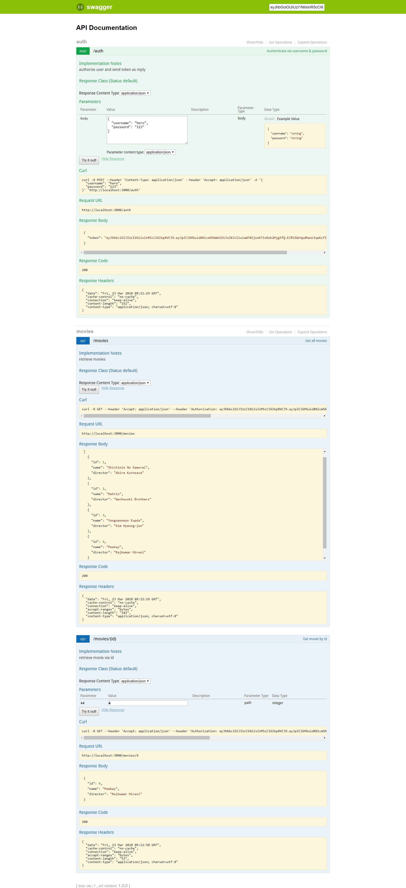

# Hapi.js Playground

Demo of creating Restful API with Hapi.js including some features, such as joi, boom, good, swagger, sequelize, sqlite, json web token authentication. 

### Prerequisites

```
node >= 8.9.0
```

### Install

clone this repo, then
```
npm init
```

## Deployment

[](https://heroku.com/deploy)

## Built With

* [Node](https://nodejs.org) - Javascript run-time environment
* [Hapi.js](https://hapijs.com) - A rich framework for building applications and services
* [Boom](https://github.com/hapijs/boom) - HTTP-friendly error objects
* [Good](https://github.com/hapijs/good) - Hapi process monitoring
* [Joi](https://github.com/hapijs/joi) - Object schema validation
* [Sequelize](http://docs.sequelizejs.com/) - Promise-based ORM for Node.js
* [Sequelize Fixtures](https://github.com/domasx2/sequelize-fixtures) - Load data from file to Sequelize
* [Sqlite](https://www.sqlite.org/index.html) - In-process library that implements a SQL database engine 
* [Hapi Swagger](https://github.com/glennjones/hapi-swagger) - Swagger documentation UI generator plugin
* [Json Web Token](https://github.com/auth0/node-jsonwebtoken) - Json Web Token
* [Hapi Auth JWT2](https://github.com/dwyl/hapi-auth-jwt2) - Simplified JSON Web Token (JWT) authentication plugin

## Usage
Just start the application with (`npm start`). The application is
running at [localhost:3000](http://localhost:3000).


Initial test data is `import.yaml` file.

Swagger path is [localhost:3000/documentation](http://localhost:3000/documentation).

Make http requests via Curl or Postman or Swagger.

Test user
```
username: hero
password: 123
```

## Methods

* Authentication [localhost:3000/auth](http://localhost:3000/auth)
* Movies [localhost:3000/movies](http://localhost:3000/movies)
* Movie [localhost:3000/movies/{id}](http://localhost:3000/movies/{id})

## Screenshot


